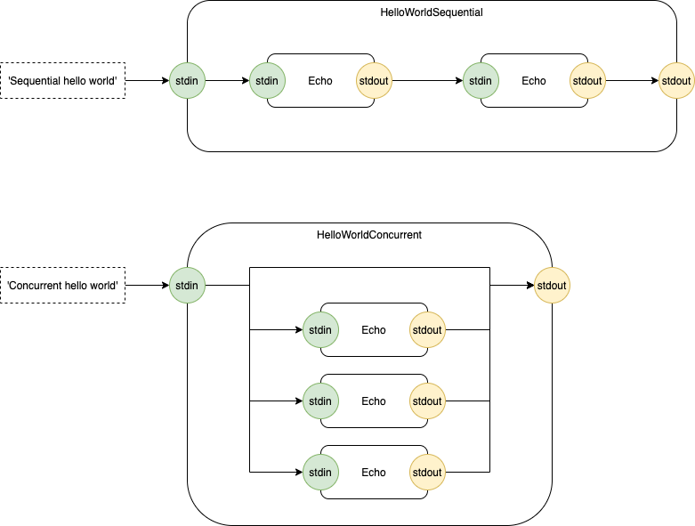
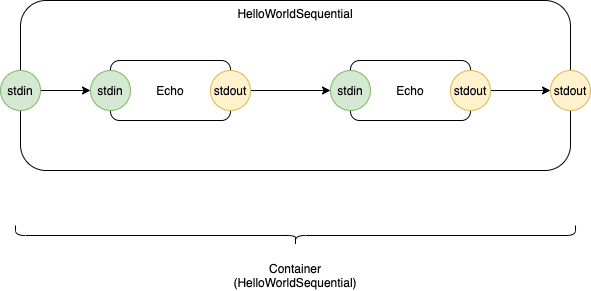
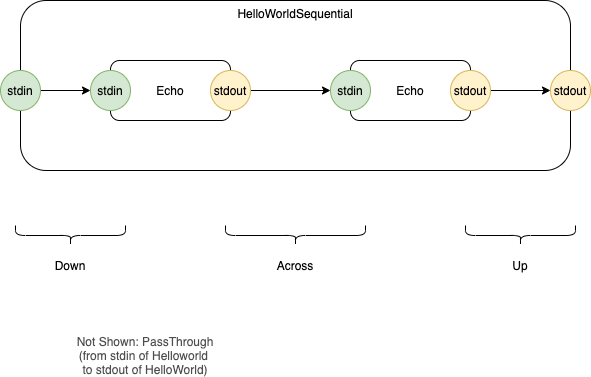
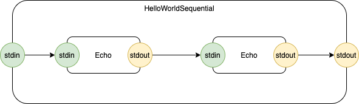
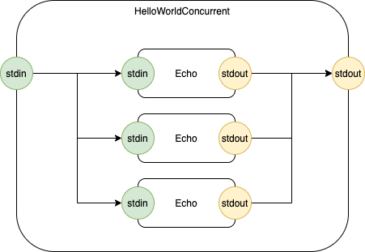
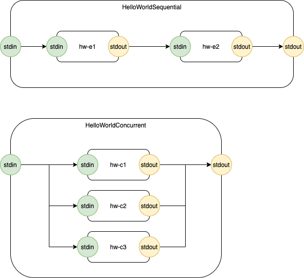

to use: 
```
make
```

This repo contains example Python code that uses 0D techniques.  

Demonstrates Sequential and Concurrent routing.

Test.py calls 2 different HelloWorld objects.

The first is Sequential.

The second is Concurrent.

Due to the simplicity of this example, the same input is passed into all connections in the concurrent version of HelloWorld.  This should result in 1 pass-through routing, 3 down routings and 3 up routings, resulting in a total of 4 ouptuts on the 'stdout' FIFO of HelloWorldConcurrent.

Start at test.py.

# Diagrams
## Test


---

## Container


---

## Leaf


---
## Routing


---

## Hello World Sequential


---

## Hello World Concurrent


---

## Names


---

# ė (EH)
*from "ė - Concurrent Lambdas" working paper 1 (not published ATM)*

As a working title for this concept, I'm going to use `ė`.

It is the Lithuanian letter "e" with a dot above it.

It is pronounced like Canadian "eh" or the English-language letter "A" (hard, not soft).

I almost chose another Greek letter, then realized that I could use any unicode character, then, almost chose a smily emoji, but, finally settled on `ė`.

[The choice is almost arbitrary, but, `ė` ties my two inherited cultures together.]

# Further
Transpiling actual diagrams to Python code is done in https://github.com/guitarvydas/eh.

Py0D is more recent (by about 1 week) than the *eh* repo and Py0D is "more presentable" at this moment.  

By "more presentable", I mean that the *py0d* repo is simpler and is a focussed only on how to build 0D components manually.  

The *eh* repo focuses on how to transpile diagrams from `.drawio` format to JSON, then Python and Common Lisp, something which is easier to understand when you already know what an *eh* 0D component looks like.  The *eh* repo contains much more code.

# Discussion of Principles
The concept is very simple, although maybe the code isn't.  I wonder if I might say this in a more-simple manner?

An ė component is a composition of 4 things: 
1. it can Send messages
2. it can Receive messages
3. it can be contained in another Component (Runnable - a backlink to the parent Container, set dynamically ATM) and
4. it is a state machine.  

State machines are susceptible to the "state explosion problem".  Harel's StateCharts are one way to solve this problem (i.e. using nesting and Structuring).  Each ė Component is asynchronous, but, might contain synchronous code in its internal implementation.  

HSMs help organize the synchronous code (only the synchronous code).  HSMs are like StateCharts minus the "othogonal state" stuff (concurrency).  You don't NEED to use HSMs for the synchronous code, but HSMs are like Structured Programming - a suggestion for organizing synchronous code.

One Component is one ė Component.  There is only one input queue and one output queue.  The rest of the innards of the Component are "code" (synchronous code).

We are accustomed to writing code - synchronous code - by writing functions.  Nothing is different about this kind of code.  If the special function Send() is used, it reaches upwards and drops messages onto the enclosing ė Component's Output Queue.

All of the code we currently write is function-based.  It is synchronous.  We wrap such function-based code in Components called Processes (Threads, etc.).  ė is just a way to make the wrappers smaller, using anonymous lambdas, inheritance, etc.  

I view Processes as ad-hoc closures. ė "cleans that up" and makes the wrappers less ad-hoc.

To this end, Initialize is a multi-headed beast.  You have to initialize the synchronous code and the asynchronous code.  Then, you might want to Reset ė Components to snap them back to some "known state".  I haven't looked, but I would bet that Erlang OTP does something like this.  It should be possible to collapse all of the initialization stuff into one lump of code and to, additionally, provide a Reset method.  I have chosen to keep the initializations separated in the hopes of making the purpose of the code more clear.

A goal is to make each stand-alone layer of code understandable and immutable (it always does what the code says it does).  This goal causes HSMs to have reverse-inheritance - parental authority - instead of the usual Inheritance behaviour that we're used to having (Children can override methods defined in the Parent).  Messages are received by the top-most ė  Component and punted to children if the parent doesn't care to deal with the message (example: lamp - OFF/ON dealt with at the top-most level, INTENSITY dealt with by Children layers).

This goal, also, implies that a Parent must be able to drag all of its Children (recursively) out of whatever State they are in.  The Exit() method is meant to be this recursive, depth-first dive.

Likewise, when an ė Component is activated, it must cause all of its Children (recursively) to Enter their default states.  The Parent calls Enter() for this recursive, depth-first dive.  

In Python, this is easy to write:
1. on Enter(), the Component initializes its own data, then calls its Children to Enter()
2. on Exit(), the Component calls its Children to Exit(), then does its own clean-up (note that the order of calls in Enter() and Exit() is subtly different)

Reset() is simply a call to Exit(), then, a call to Enter() on the Default State.

Note that an HSM "remembers" what its Default State is supposed to be, so that it can Reset() back to it on demand.

Initialization happens only once at the beginning of time.  Reset() can happen more than once.  This combination allows an ė Component to remember history instead of wiping the slate clean.  In electronics, Initialization is called *cold-start* and Reset() is called *warm-start*.  Harel's StateChart notation uses a History (H) bubble to access history.  ė lets you be more ad-hoc  (that's probably not a good thing and should be addressed in the future) by using mutable variables.

This kind of thinking goes beyond what we are currently accustomed to doing with (only) functions.  Actors and Processes nip at the heels of this kind of thinking.  StateCharts are a more-structured way of thinking this way.  Note that StateCharts are VPLs.

Aside: Structured Programming gave us a way to nest (layer) control flow.  HSMs give a way to nest control flow.

Aside: You can draw sensible drawings of ė Component networks.  You can't draw sensible drawings of synchronous code.  The big (but subtle) difference is 0D - using FIFOs (queues) instead of LIFOs (stacks).  To draw technical diagrams, you need to use FIFOs.  You can use 0D for textual code and skip the technical drawings, if you wish.  I claim that after people get used to the idea of 0D, they will choose to draw programs instead of coding programs up as text.  We'll see...  (Aside: all Real Engineering professions use technical drawings - blueprints, molecule diagrams, electronics schematics, etc.)

duplicated in: https://publish.obsidian.md/programmingsimplicity/2022-11-18-ė+Considerations
